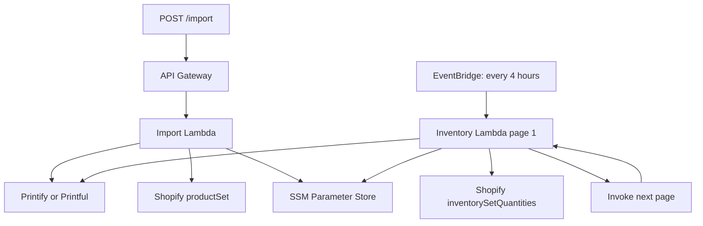

# Printify / Printful → Shopify automation

Production-oriented Node.js/TypeScript service that imports an existing Printify or Printful product into Shopify on demand and synchronizes POD availability every four hours.

## What it does

- `POST /import` accepts a provider and provider product ID.
- Pulls the complete product, variants, option values, mockup images, SKUs, and provider prices.
- Applies `ceil((cost × 1.5) + 5) - 0.01` by default. The multiplier and fixed amount are configurable.
- Upserts the Shopify product by deterministic handle, so retrying the same import updates the product instead of duplicating it.
- Uses Shopify `productSet`, including product options, all variants, variant metafields, initial availability, and provider-hosted image URLs.
- Every four hours, reads active Shopify variants in pages, groups them by provider product, fetches provider availability, and updates Shopify using compare-and-swap plus required idempotency keys.
- Chains one Lambda invocation per Shopify page. Large catalogs do not have to finish inside one Lambda execution.
- Retrieves encrypted API credentials from SSM Parameter Store at runtime. No token is committed or placed in Lambda environment variables.

## Current API choices

This implementation targets the current stable Shopify Admin GraphQL API `2026-07`.

- Shopify recommends [`productSet`](https://shopify.dev/docs/api/admin-graphql/latest/mutations/productSet) for synchronizing an external data source.
- Shopify has deprecated `inventorySetOnHandQuantities`; this project uses [`inventorySetQuantities`](https://shopify.dev/docs/api/admin-graphql/latest/mutations/inventorySetQuantities), its required `@idempotent` directive, and `changeFromQuantity` compare-and-swap protection.
- Printify shop-product endpoints are currently in [Printify API v1](https://developers.printify.com/). Its v2 catalog currently covers newer catalog/shipping functionality, not shop-product management.
- Printful v2 does not yet provide sync-product management. The adapter therefore uses the [Printful Store Products API](https://developers.printful.com/docs/) for the merchant's sync product and [Printful v2](https://developers.printful.com/docs/v2-beta/) for current catalog prices and regional stock availability.
- Lambda runs on the managed `nodejs24.x` ARM64 runtime.

## Important POD inventory behavior

Printify and Printful expose availability/status for POD variants, not a reliable physical unit count that can be copied to Shopify. The service maps:

| Provider state | Shopify `available` quantity |
|---|---:|
| Available / in stock | `IN_STOCK_QUANTITY` (default `100`) |
| Unavailable / out of stock | `0` |
| Variant missing from a provider response | No Shopify change; warning logged |

This prevents an incomplete provider response from zeroing valid inventory. Set `IN_STOCK_QUANTITY` to the buffer appropriate for the store.

## Architecture



No database is required. Durable source mappings are stored as Shopify variant metafields in the `pod_sync` namespace.

At this workload, Lambda requests and compute should normally remain inside the current monthly free allowance of one million requests and 400,000 GB-seconds. API Gateway, EventBridge, CloudWatch, data transfer, KMS choices, and other AWS services have their own pricing, so enable an AWS Budget rather than treating the complete stack as unconditionally free.

## Prerequisites

- AWS account and AWS CLI credentials able to deploy Lambda, API Gateway, EventBridge, IAM, and CloudWatch Logs.
- Node.js 24.
- Serverless Framework v4. `npx serverless` may ask you to sign in according to Serverless Framework's current licensing rules.
- Shopify custom app Admin API token with:
  - `read_products`
  - `write_products`
  - `read_inventory`
  - `write_inventory`
  - `read_locations`
- Printify personal access token with at least `shops.read`, `products.read`, and `catalog.read`.
- Printful private token that can read store sync products and v2 catalog data. If the token is account-level, configure `PRINTFUL_STORE_ID`.
- The source product must already exist in the configured Printify shop or as a Printful sync product.

This repository automates catalog and availability synchronization. It does **not** submit Shopify orders to Printify/Printful. If the provider app is not already responsible for fulfillment, order webhooks and provider order creation are a separate required workflow.

## 1. Install

```bash
git clone https://github.com/jabol183/printify-automation-.git
cd printify-automation-
npm ci
cp .env.example .env
```

Load `.env` in your shell or CI environment before deployment. Serverless reads these non-secret deployment settings:

```bash
export SHOPIFY_SHOP="your-store.myshopify.com"
export SHOPIFY_LOCATION_ID="gid://shopify/Location/123456789"
export PRINTIFY_SHOP_ID="12345678"
export PRINTIFY_CURRENCY="USD"
export PRINTFUL_STORE_ID=""
export PRINTFUL_CURRENCY="USD"
export PRINTFUL_SELLING_REGION="worldwide"
```

The configured Printify/Printful price currency must match the Shopify shop currency. Currency conversion is intentionally not guessed.

Markup is applied to Printify's variant `cost` and Printful v2's catalog/technique cost. The importer fails if a provider cost is missing; it never silently marks up an existing retail price.

To obtain a Shopify location ID, run this in the Shopify Admin GraphiQL app:

```graphql
query Locations {
  locations(first: 20) {
    nodes { id name isActive }
  }
}
```

## 2. Create SSM parameters

Generate an import endpoint key:

```bash
openssl rand -hex 32
```

Create four Standard `SecureString` parameters. Replace the placeholders and region:

```bash
aws ssm put-parameter --region eu-central-1 --name /print-sync/dev/shopify-access-token --type SecureString --value 'shpat_REPLACE_ME'
aws ssm put-parameter --region eu-central-1 --name /print-sync/dev/printify-token --type SecureString --value 'REPLACE_ME'
aws ssm put-parameter --region eu-central-1 --name /print-sync/dev/printful-token --type SecureString --value 'REPLACE_ME'
aws ssm put-parameter --region eu-central-1 --name /print-sync/dev/import-api-key --type SecureString --value 'REPLACE_WITH_RANDOM_VALUE'
```

Use `/print-sync/prod/...` when deploying with `--stage prod`.

## 3. Deploy

```bash
npm run typecheck
npm test
npx serverless deploy --stage dev --region eu-central-1
```

The deployment output includes the API Gateway URL. EventBridge is installed automatically with:

```text
cron(0 */4 * * ? *)
```

## 4. Import products

Printify:

```bash
curl -X POST 'https://YOUR_API_ID.execute-api.eu-central-1.amazonaws.com/import' \
  -H 'content-type: application/json' \
  -H 'x-import-key: YOUR_RANDOM_IMPORT_KEY' \
  --data '{"provider":"printify","productId":"PRODUCT_ID","status":"DRAFT"}'
```

Printful:

```bash
curl -X POST 'https://YOUR_API_ID.execute-api.eu-central-1.amazonaws.com/import' \
  -H 'content-type: application/json' \
  -H 'x-import-key: YOUR_RANDOM_IMPORT_KEY' \
  --data '{"provider":"printful","productId":123456789,"status":"ACTIVE"}'
```

`DRAFT` is the default and safest first import. Use `ACTIVE` only when the item should immediately be sellable. Products with more than 100 variants or images use Shopify's asynchronous product-set operation. The endpoint polls it for up to 30 seconds; if it is still running, it returns HTTP `202` with an `operationId`.

Reimporting the same provider/product pair updates the deterministic Shopify handle:

```text
pod-printify-PRODUCT_ID
pod-printful-PRODUCT_ID
```

Because `productSet` treats variants as a complete list, a source variant removed from Printify/Printful is removed from Shopify on the next manual reimport. The four-hour job only changes inventory quantities.

## Configuration

| Variable | Default | Purpose |
|---|---:|---|
| `SHOPIFY_API_VERSION` | `2026-07` | Stable Shopify Admin API version |
| `MARKUP_MULTIPLIER` | `1.5` | Cost multiplier |
| `MARKUP_FIXED_AMOUNT` | `5` | Amount added before `.99` rounding |
| `IN_STOCK_QUANTITY` | `100` | Shopify quantity for an available POD variant |
| `SYNC_PAGE_SIZE` | `100` | Active Shopify variants processed per invocation, max 250 |
| `SECRET_CACHE_TTL_MS` | `300000` | In-memory SSM secret cache lifetime |
| `PRINTFUL_SELLING_REGION` | `worldwide` | Region used for Printful v2 availability/pricing |

## Rotating API keys (SOP)

Tokens are read from SSM at runtime and cached only in warm Lambda memory for `SECRET_CACHE_TTL_MS` (five minutes by default). They are never resolved by Serverless into the deployed environment.

1. In AWS Console, open **Systems Manager → Parameter Store**.
2. Open the relevant `/print-sync/STAGE/...` parameter.
3. Choose **Edit**, replace the value, and save it as `SecureString`.
4. Wait up to the configured cache TTL. Every warm Lambda automatically fetches the new version after its cache entry expires.
5. Run a test import for provider-token changes and invoke the inventory function once for a sync check.
6. After verification, revoke the old credential at Shopify, Printify, or Printful.

CLI equivalent:

```bash
aws ssm put-parameter \
  --region eu-central-1 \
  --name /print-sync/prod/shopify-access-token \
  --type SecureString \
  --value 'NEW_TOKEN' \
  --overwrite
```

For emergency activation before the cache TTL, redeploy both functions to create fresh execution environments:

```bash
npx serverless deploy function -f importProduct --stage prod --region eu-central-1
npx serverless deploy function -f syncInventory --stage prod --region eu-central-1
```

There is no Lambda “restart” action that should be part of normal rotation. Reducing `SECRET_CACHE_TTL_MS` makes rotations propagate sooner at the cost of more SSM reads.

## Reliability and operations

- HTTP calls use bounded timeouts, exponential backoff, jitter, and `Retry-After` handling.
- Shopify GraphQL throttling is retried based on its cost/throttle response.
- Inventory writes use absolute quantities, compare-and-swap, and deterministic UUID idempotency keys, as required by Shopify `2026-07`.
- EventBridge/Lambda asynchronous failures retry twice for up to six hours.
- `reservedConcurrency: 1` prevents two pages of this function from changing inventory simultaneously.
- Missing provider availability is logged and skipped.
- Logs are structured JSON and retained for 14 days.
- Lambda X-Ray tracing is enabled.

View logs:

```bash
npx serverless logs -f importProduct --stage dev --tail
npx serverless logs -f syncInventory --stage dev --tail
```

Manually start a sync:

```bash
aws lambda invoke \
  --region eu-central-1 \
  --function-name printify-printful-shopify-sync-dev-syncInventory \
  --cli-binary-format raw-in-base64-out \
  --payload '{"id":"manual-run","detail":{}}' \
  /tmp/sync-response.json
```

## Development

```bash
npm run typecheck
npm test
```

The GitHub Actions workflow runs both commands on pushes to `main` and pull requests.

## Project layout

```text
serverless.yml
src/
  handlers/
    importProduct.ts
    syncInventory.ts
  services/
    distributors/
      factory.ts
      printful.ts
      printify.ts
    secretStore.ts
    shopify.ts
  types/
  utils/
tests/
```
